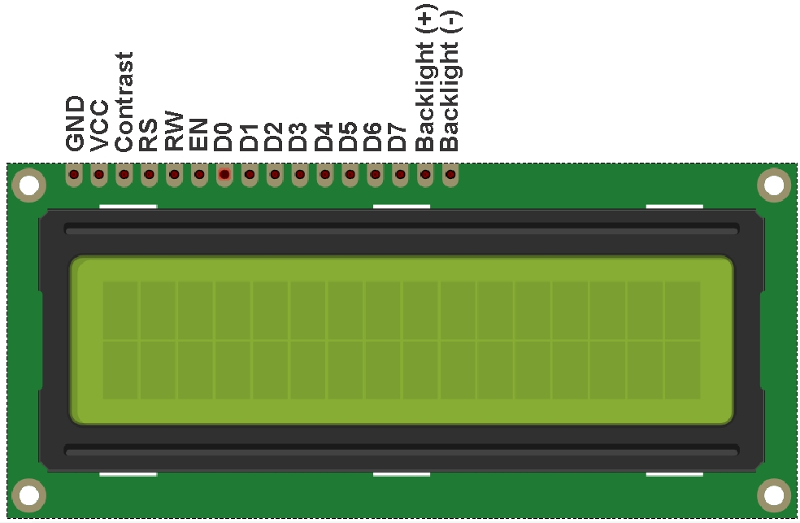

## CROSS PLATFORM, C DRIVER LIBRARY FOR 16X2 LIQUID CRYSTAL DISPLAY
---


This library provides APIs that allow a mircocontroller to interact with 16X2 LCD module. The driver currently supports only 16x2 LCD fitted with I2C adapter. Support for direct interfacing of LCD module will be shortly included.

<br/>



<br/>
<br/>

## API reference for 'LiquidCrystal_driver' library
---

```
char InitializeLCD(uint8_t address)
```

> **ONLY FOR LCD WITH I2C ADAPTER !**

This API is used to initialize the LCD.

**Parameters**

1. `uint8_t address` : Address of the I2C adapter.

**Returns**

Type : `char`

`1` Success <br/>
`0` Failed

<br/>
<br/>

```
char LCDClearDisplay()
```

This API is used to clear the LCD display. It also resets the cursor position to (0,0) in 16x2 display grid.

**Parameters**

NONE

**Returns**

Type : `char`

`1` Success <br/>
`0` Failed

<br/>
<br/>


```
char LCDDisplayHome()
```

This API is used to return the cursor to home position (0,0).

**Parameters**

NONE

**Returns**

Type : `char`

`1` Success <br/>
`0` Failed

<br/>
<br/>


```
char LCDDisplayOn()
```

This API is used to turn ON the LCD display.

**Parameters**

NONE

**Returns**

Type : `char`

`1` Success <br/>
`0` Failed

<br/>
<br/>


```
char LCDDisplayOff()
```

This API is used to turn OFF the LCD display.

**Parameters**

NONE

**Returns**

Type : `char`

`1` Success <br/>
`0` Failed

<br/>
<br/>


```
char LCDCursorEnable()
```

This API is used to show the cursor on the LCD.

**Parameters**

NONE

**Returns**

Type : `char`

`1` Success <br/>
`0` Failed

<br/>
<br/>


```
char LCDCursorDisable()
```

This API is used to hide the cursor.

**Parameters**

NONE

**Returns**

Type : `char`

`1` Success <br/>
`0` Failed

<br/>
<br/>


```
char LCDBacklightEnable()
```

This API is used to turn on the backlight of the display.

**Parameters**

NONE

**Returns**

Type : `char`

`1` Success <br/>
`0` Failed

<br/>
<br/>


```
char LCDBacklightDisable()
```

This API is used to turn off the backlight of the display.

**Parameters**

NONE

**Returns**

Type : `char`

`1` Success <br/>
`0` Failed

<br/>
<br/>


```
char LCDCursorPosition(uint8_t x, uint8_t y)
```

This API is used to set cursor at a position on the display.

**Parameters**

1. `uint8_t x` : The x position of the cursor (0-15.)
2. `uint8_t y` : The y position of the cursor (0-1.)

**Returns**

Type : `char`

`1` Success <br/>
`0` Failed

<br/>
<br/>


```
char LCDPrintChar(uint8_t ch_code)
```

This API is used to print a character on the display. The character is printed at the current cursor position. Once the last character position is occupied, the cursor moves to the first character position.

**Parameters**

1. `uint8_t ch_code` : The character to be displayed.

**Returns**

Type : `char`

`1` Success <br/>
`0` Failed to print<br/>
`2` Failed to adjust cursor position after printing

<br/>
<br/>


```
char LCDPrintStr(uint8_t * ch_code_str, uint8_t len)
```

This API is used to print a character string on the display. Printing starts at current cursor position. Once the last character position is occupied, the cursor automatically moves to the first character position.

**Parameters**

1. `uint8_t * ch_code_str` : Pointer to character string.
2. `uint8_t len` : Number of character in the String

**Returns**

Type : `char`

`1` Success <br/>
`0` Failed to print<br/>
`2` Failed to adjust cursor position after printing

<br/>
<br/>


```
char LCDPrintCustomChar(uint8_t ch_code)
```

This API is used to print one of the user-defined character on the display. The character is printed at the current cursor position. Once the last character position is occupied, the cursor moves to the first character position.

**Parameters**

1. `uint8_t num` : The user defined character number (0-7). LCD can store upto 8 user-defined characters.

**Returns**

Type : `char`

`1` Success <br/>
`0` Failed to print<br/>
`2` Failed to adjust cursor position after printing

<br/>
<br/>


```
char LCDStoreCustomCharacter(uint8_t num, uint8_t pattern[8])
```

This API is used to store a custom dot matrix character in the LCD module. LCD module can store upto 8 user-defined characters.

**Parameters**

1. `uint8_t num` : The user defined character number (0-7). LCD can store upto 8 user-defined characters.
2. `uint8_t pattern[8]` : Array containing the pattern.

**Returns**

Type : `char`

`1` Success <br/>
`0` Failed to print<br/>
`2` Failed to adjust cursor position after printing

<br/>
<br/>


## Platform Abstraction Layer
---

This is the layer that makes the driver cross platform compatible. To adapt the library for a particular platform, put in the platform specific code inside the function definitions present in `LiquidCrystal_pal.c` file.